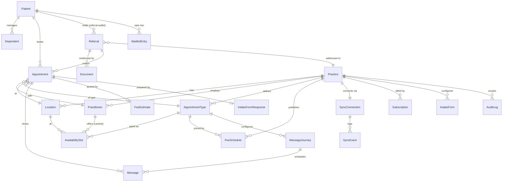

# Data Model — GetBooked

Authoritative schema: [`packages/db/prisma/schema.prisma`](../packages/db/prisma/schema.prisma).
This document explains the shape and the lifecycle rules. All §11 first-class entities are
modelled; the referral is a first-class object from day one (§6).

## ERD (core entities)



## Lifecycle rules

### Referral (first-class, §5.2 / §6)

```
DRAFT → UPLOADED → EXTRACTED → VERIFIED → ACTIVE → (EXPIRING) → EXPIRED
                                   └→ REJECTED (illegible / invalid)
```

- `periodMonths` ∈ {3, 12, null=indefinite}; `expiresAt` is **derived by deterministic
  code** from `referralDate` + period (never by the AI extractor) and stored denormalised
  for the expiry-alert job.
- Alert rule (§14 acceptance): a referral whose `expiresAt` precedes a linked future
  appointment's start time raises alerts to both patient and practice.
- Extraction output is stored alongside human-verified values — `extracted*` fields are
  never trusted until a human confirm sets `verifiedAt`.
- GP-sent referrals (Phase 2 secure messaging) enter at `UPLOADED` with
  `source = GP_SECURE_MESSAGING`; the object and lifecycle are identical.

### Appointment

```
REQUESTED → TRIAGED → CONFIRMED → COMPLETED
     │          │          ├→ CANCELLED (by patient/practice; reason captured)
     │          │          └→ NO_SHOW
     │          └→ DECLINED (templated, kind message)
     └→ EXPIRED (request unactioned past practice-set window)
```

- `REQUESTED` is the universal entry state: in live-sync mode it passes through
  instantly to `CONFIRMED` unless the appointment type requires triage-before-confirm
  (§7.3); in request mode it waits for one-click practice confirmation.
- `source` ∈ {MARKETPLACE, WIDGET, PHONE, PMS} — phone/PMS rows arrive via sync so the
  dashboard's bookings-by-source and fill-rate views are complete.
- Idempotency: PMS writes carry `idempotencyKey`; local table carries a unique
  `(slotId, status=CONFIRMED)` partial constraint for managed-calendar mode.

### AvailabilitySlot

Cached projection of PMS availability (or platform-mastered in managed-calendar mode);
never authoritative in live-sync mode — Xestro wins conflicts at write time. Slot holds
live in Redis, not in this table; only confirmed state lands here.

### WaitlistEntry

`ACTIVE → OFFERED (claim window, exclusive) → CLAIMED | LAPSED → ACTIVE…` —
offer sequencing and exclusivity are enforced by the slot-hold primitive.

### FeeSchedule / FeeEstimate (§5.3)

`FeeSchedule` is the practice-published structured fee per appointment type
(consult fee, expected Medicare rebate, estimated gap, deposit + cancellation policy,
`lastVerifiedAt` for the staleness stamp). `FeeEstimate` snapshots those numbers onto the
appointment at booking time — the patient's itemised quote is immutable evidence of what
was disclosed, even if the schedule changes later.

### Privacy-sensitive fields

`medicareNumberEnc`, `dvaNumberEnc`, `healthFundEnc` are stored as KMS-envelope
ciphertext (field-level, §10.2) and are never indexed or logged. Documents store S3 keys
only. Every read of these fields goes through an accessor that writes an `AuditLog` row.

### AuditLog

Append-only: `(actorType, actorId, action, entityType, entityId, practiceId,
patientId?, metadata, createdAt)`. Written in-transaction with the action. Support
impersonation sessions write paired `IMPERSONATION_START/END` rows with recorded consent
reference.
